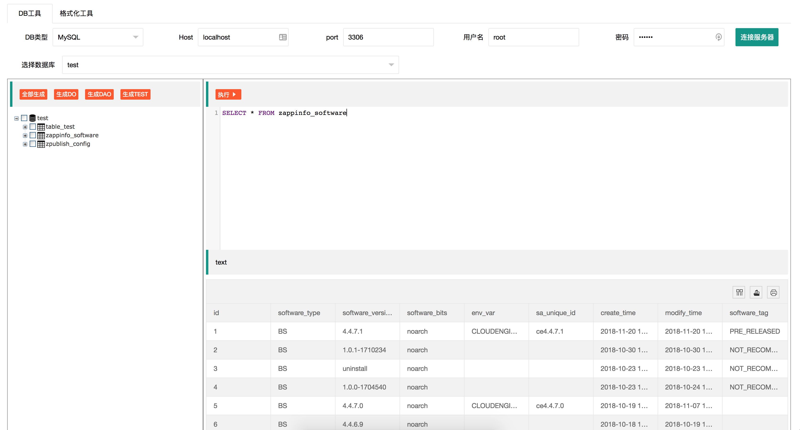

# u-dao-generator

#### 20181121 idea
- 表名 字段名 自动提示
- 前端页面编辑之后update记录
- DB查询出来的记录转json
- json格式化 https://github.com/junbaor/json
- json转java类
- 查询出来的记录转insert语句和excel
- 页面操作时，在合适的位置显示执行的sql语句，sql执行历史保存
- 光标在某一行时 执行该行sql
- 保存系统配置（host port username password等）